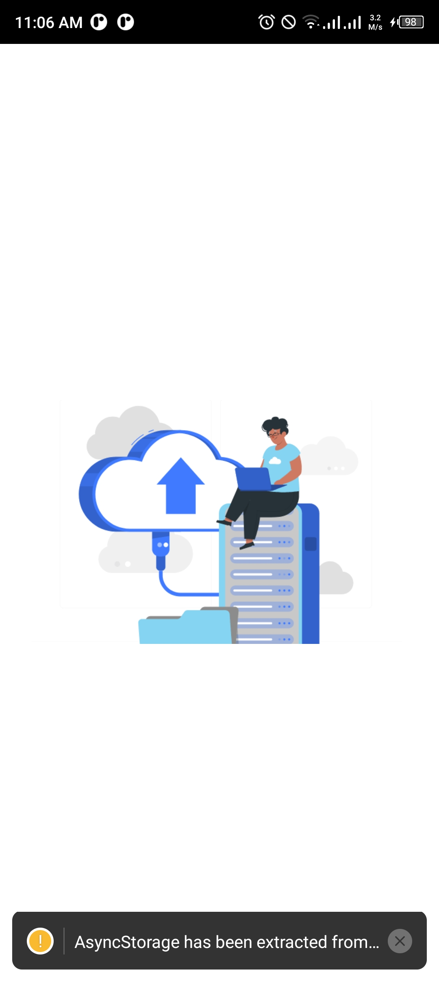
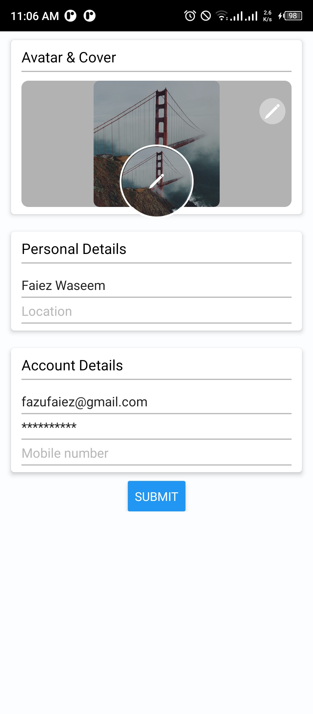

<br/>
<p align="center">
  <a href="https://github.com/FaiezWaseem/FaiezWaseem/cloud9infinity">
    
  </a>

  <h3 align="center">cloud9infinity</h3>

  <p align="center">
    An Awesome free cloud storage
    <br/>
    <br/>
    <a href="https://github.com/FaiezWaseem/FaiezWaseem/cloud9infinity">View Demo</a>
    .
    <a href="https://github.com/FaiezWaseem/FaiezWaseem/cloud9infinity/issues">Report Bug</a>
    .
    <a href="https://github.com/FaiezWaseem/FaiezWaseem/cloud9infinity/issues">Request Feature</a>
  </p>
</p>

    

## About The Project
<p align="center">
  <a href="https://github.com/FaiezWaseem/FaiezWaseem/cloud9infinity">
    
  </a>
  </p>
<p align="center">
  <a href="https://github.com/FaiezWaseem/FaiezWaseem/cloud9infinity">
    
  </a>
  </p>
<p align="center">
  <a href="https://github.com/FaiezWaseem/FaiezWaseem/cloud9infinity">
    
  </a>
  </p>
<p align="center">
  <a href="https://github.com/FaiezWaseem/FaiezWaseem/cloud9infinity">
    
  </a>
  </p>
<p align="center">
  <a href="https://github.com/FaiezWaseem/FaiezWaseem/cloud9infinity">
    
  </a>
  </p>
<p align="center">
  <a href="https://github.com/FaiezWaseem/FaiezWaseem/cloud9infinity">
    
  </a>
  </p>


Hi there ! 🖐 , wellcome to cloud9infinity Repo , cloud9infinity is an opensource React Native Project , which functions as a cloud Storage Manager . It uses Firebase as a Backend and Save Files on Cloud Through free cloud storage website AnonFiles .

# Features

* Create Folder
*  ~ Sub Folder (hierarchy structure)
* upload all type or media and Files
* Play Videos
* Images Load To cache
* Download Files
* Share Link


## Built With

Expo Cli And then Eject To React Native  Cli 

## Getting Started

To get a local copy up and running follow these simple example steps.

### Prerequisites


* node
* npm
* react native cli
```sh
npm install npm@latest -g
```

### Installation

1. Install Node [install](https://nodejs.org/en/download/)
2. Install React Native Cli [install](https://www.npmjs.com/package/react-native-cli)

3. Clone the repo
```sh
git clone https://github.com/FaiezWaseem/cloud9infinity.git
```

4. Install NPM packages

```sh
npm install
```

5. Create file in root Directory `config.js`
Enter your Firebase Config in `config.js`

```JS
export default config = {
    apiKey: "YOUR_API_KEY_HERE",
     authDomain: "YOUR_API_KEY_HERE,
     databaseURL: "YOUR_API_KEY_HERE",
     projectId: "YOUR_API_KEY_HERE",
     storageBucket: "YOUR_API_KEY_HERE",
     messagingSenderId: "YOUR_API_KEY_HERE",
     appId: "YOUR_API_KEY_HERE",
     measurementId: "YOUR_API_KEY_HERE"
         }
```


### Creating A Pull Request

1. Fork the Project
2. Create your Feature Branch (`git checkout -b feature/AmazingFeature`)
3. Commit your Changes (`git commit -m 'Add some AmazingFeature'`)
4. Push to the Branch (`git push origin feature/AmazingFeature`)
5. Open a Pull Request

## License

Distributed under the MIT License. See [LICENSE](https://github.com/FaiezWaseem/FaiezWaseem/cloud9infinity/blob/main/LICENSE.md) for more information.

## Authors

* **Faiez Waseem** - *Comp Sci Student* - [Faiez Waseem](https://github.com/FaiezWaseem//) 

## Acknowledgements

* [FaiezWaseem/](https://github.com/FaiezWaseem//)
* []()
* [ImgShields](https://shields.io/)
